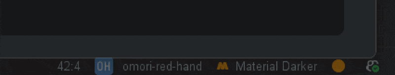

# Omori Progress Bar

<p align="center">
  
</p>

Replaces **every progress bar in the IDE** with an OMORI-flavoured one: a black-and-white barber-pole track with a
little red hand that rides the leading edge — pacing back and forth while work is indeterminate, and advancing with the
fill when progress is known.



> A fan project. Not affiliated with or endorsed by OMOCAT. (Again OMOCAT, don't dare to take this down (. ❛ ᴗ ❛.), dev
> needs to have fun too (●'◡'●) )

## What it does

- Recolours **all** progress bars — indexing, Gradle sync, VCS operations, any background task.
- **Indeterminate:** the red hand paces left↔right, pointing in the direction it travels.
- **Determinate:** the hand rides the growing fill from 0 % to 100 %.
- Purely cosmetic. No settings, no background threads of its own, no per-project state.
- Works in **all** JetBrains IDEs (`com.intellij.modules.platform`).

## What it doesn't do

- Won't help you finish your work faster. It just makes the wait a little more fun (●'◡'●)
- Won't solve any bugs in your code. (if a bug exist in your code, it will still exist in your code (～￣▽￣)～ but it will
  look cooler (. ❛ ᴗ ❛.) )

## How it works

There is no extension point for styling progress bars, so the plugin swaps Swing's UI delegate directly:

- `OmoriRedHandBar extends BasicProgressBarUI` overrides `paintIndeterminate` /
  `paintDeterminate` — the only two "slots" the platform asks a delegate to fill.
- An application listener (`OmoriProgressListener`) points the global
  `UIManager` `"ProgressBarUI"` key at that class. It re-applies on window activation (bootstrap) and on look-and-feel
  change (a theme switch rebuilds `UIManager` and would otherwise drop the registration).
- Animation carries **no mutable state**: sprite position is derived from the platform's own frame counter, so it can't
  drift with stray repaints.

## Building

```bash
./gradlew buildPlugin      # produces the installable zip in build/distributions/
./gradlew runIde           # launches a sandbox IDE with the plugin loaded
./gradlew verifyPlugin     # checks API compatibility against the declared since-build
```

Compatibility: **since-build 233** (2023.3) with an open upper bound.

## Repository layout

```
src/main/java/
├── bars/OmoriRedHandBar.java          The ProgressBarUI delegate (all the painting)
├── interfaces/IOmoriBar.java          Marker for future bar variants
├── listener/OmoriProgressListener.java Registers the delegate with UIManager
└── actions/SummonProgressAction.java  Dev-only tester (gated out of the shipped plugin)
src/main/resources/
├── icons/redHand.png, redHand@2x.png  The sprite (1x + HiDPI)
└── META-INF/
    ├── plugin.xml                      Plugin manifest
    ├── pluginIcon.svg                  Logo (light theme)
    └── pluginIcon_dark.svg             Logo (dark theme, inverted)
assets/                                 README images
art/                                    Source art masters (not shipped)
```

## Previewing the bar during development

The bar only appears when the IDE is actually busy, so there's a dev-only action to summon one on demand. It's commented
out in `plugin.xml` for release — uncomment the `<actions>`
block, run `./gradlew runIde`, then **Tools → Omori: Summon Progress Bar**. It runs a fake task through both modes
(indeterminate, then determinate 0→100 %).

## License

The code is released under its repository license. OMORI and its imagery are the property of OMOCAT; this plugin is an
unofficial fan work.

## Creator

Made with ❤️ by none other than Issa Loubani (yup, that's me (❁´◡`❁), feel free to contribute, or not, your call not
mine ㄟ (▔, ▔ )ㄏ)

## Note

I am planning on more bars in future, IF anyone wants, for me, this is enough (at least for now 👀)